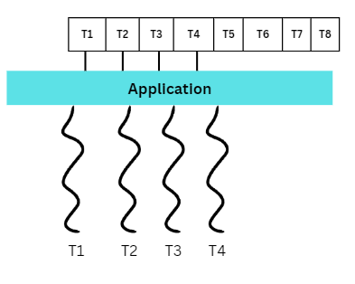

# WorkGroup Threading Model

- The WorkGroup model, also known as the Thread Pool model, is a multithreading design pattern used to manage a pool of worker threads that execute tasks concurrently.
- This model helps in efficiently managing system resouces by reusing a fixed number of threads to perform multiple tasks, instead of creating and destroying threads of each task.
- This approach reduces the overhead associated with thread creation and destruction, leading to better performance and resource utilization.
- In the WorkGroup model, each application thread is an equal parner, and all collaborate to perform a large rask.
- Each thread performs a distinct well-defined subtask. If an application naturally has independent subtasks that can be executed concurretnly, it could apply the WorkGroup model by mapping each subtask to an independent thread of control.



```cpp

#include <iostream>
#include <thread>
#include <mutex>
#include <condition_variable>
#include <functional>
#include <atomic>
#include <chrono>
#include <vector>
#include <queue>

using namespace std;

class WorkGroupModel {

public:
    WorkGroupModel(int numOfThreads);
    ~WorkGroupModel();

    void assignTask(std::function<void()> task);
private:

    void worker();  // Thread function
    std::vector<std::thread> workers; // maintain all the worker threads
    // maintain all the tasks need to performed by workers
    std::queue<std::function<void()>> tasks;
    std::mutex mtxQueu;
    std::condition_variable cv;
    std::atomic<bool> stop; // prevent for data race
};


// Create given number of threads
WorkGroupModel::WorkGroupModel(int numOfThreads):stop(false)
{

    for (int ind = 0; ind < numOfThreads; ind++) {

        workers.emplace_back([this] {
            worker();
            });
    }
}

/*

Insert a task to tasks queue.
Before inserting lock queue.
After inserting release queue and notify using conditional variable

*/
void WorkGroupModel::assignTask(std::function<void()> task)
{
    {
        std::unique_lock<std::mutex> lock(mtxQueu);
        tasks.push(std::move(task));
    }

    cv.notify_one();
}

/*
 The method assign task to the woker thread
 - First lock the mutex
 - conditional variable waut for the signal
 - If tasks queue is empty return
 - Else take task from the queue and assign to worker thread

*/
void WorkGroupModel::worker() {


    while (!stop) {


        std::function<void()> task;
        {
            std::unique_lock<std::mutex> lock(mtxQueu);
            cv.wait(lock, [this] {
                return stop || !tasks.empty();
                });

            if (stop && tasks.empty()) {
                return;
            }

            task = std::move(tasks.front());
            tasks.pop();
        }

        task();

    }

}

// Task function
void sampleTask(int taskId)
{

    std::cout << "Task " << taskId << " is being processed by thread "
        << std::this_thread::get_id() << std::endl;

    std::this_thread::sleep_for(std::chrono::seconds(2));

    std::cout<<"Task "<<taskId<<" is completed by thread "
        << std::this_thread::get_id() << std::endl;
}

// Destructor
/*
 initialize stop=true and notify all conditional variable to stop
 If threads are joinable, join all the threads
*/

WorkGroupModel::~WorkGroupModel() {
    stop = true;
    cv.notify_all();
    for (std::thread& worker : workers) {
        if (worker.joinable()) {
            worker.join();
        }
    }
}


int main()
{

    // Ceate WorkGroup object
    WorkGroupModel wg(5);

    // insert task to task queue
    for (int taskId = 0; taskId < 10; taskId++) {
        wg.assignTask([taskId] {
            sampleTask(taskId);
            });
    }

    std::this_thread::sleep_for(std::chrono::seconds(5));
    return 0;
}

```
